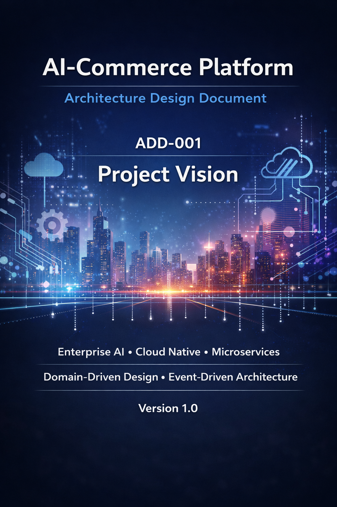
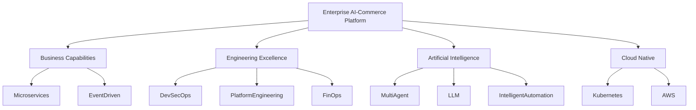
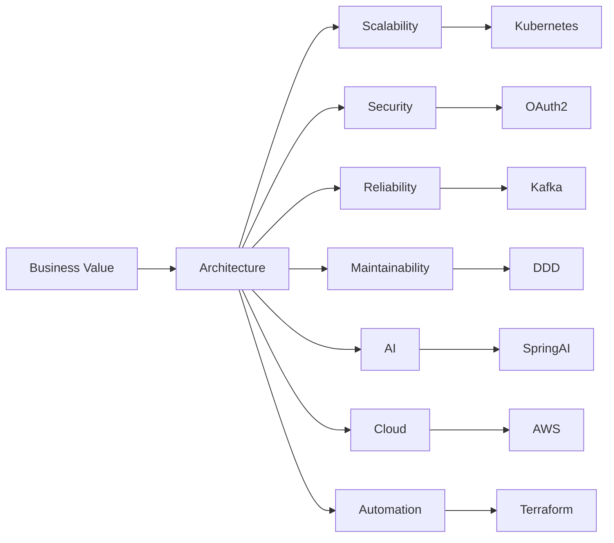
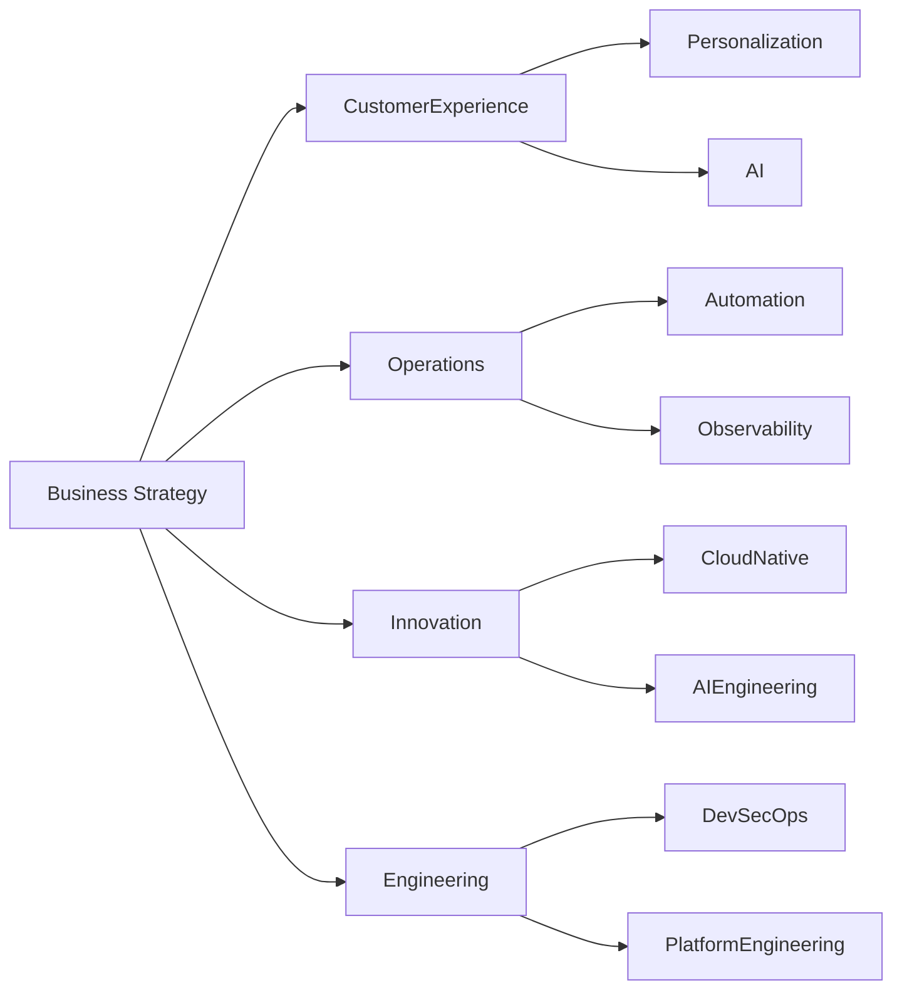

# AI-Commerce Platform

## Architecture Design Document

### ADD-001 — Project Vision

Enterprise Architecture & AI Engineering Reference Platform

Designed as a production-grade cloud-native reference architecture for intelligent commerce systems powered by Artificial Intelligence.

---

---

# Document Information

| Property | Value                         |
|-----------|-------------------------------|
| Document ID | ADD-001                       |
| Title | Project Vision                |
| Project | AI-Commerce Platform          |
| Repository | ai-commerce-platform          |
| Version | 1.0.0                         |
| Status | Approved                      |
| Document Type | Architecture Design Document  |
| Standard | ISO/IEC/IEEE 42010            |
| Classification | Public                        |
| Owner | Oliver Santos                 |
| Maintainer | AI-Commerce Architecture Team |
| Review Cycle | Quarterly                     |
| Last Updated | July 2026                     |

---

# Document Metadata

| **Category** | **Description** |
|---------------|---------------|
| Architecture Style | Domain-Driven Design (DDD) |
| Architectural Pattern | Ports and Adapters (Hexagonal Architecture) |
| System Architecture | Microservices |
| Integration Style | Event-Driven Architecture |
| Communication | REST + Kafka |
| Deployment | Cloud Native |
| Cloud | AWS |
| Runtime | Kubernetes |
| Infrastructure | Terraform |

---

# Revision History

| Version | Date | Author | Description |
|-----------|-----------|------------|----------------|
| 1.0.0 | July 2026 | Oliver Santos | Initial Architecture Vision |

---
# Table of Contents

1. Purpose & Executive Summary
2. Business Context
   2.1 Problem Statement  
   2.2 Vision & Mission  
   2.3 Business Drivers  
   2.4 Strategic Objectives  
   2.5 Stakeholders  
   2.6 Project Scope
3. Architecture Overview
   3.1 Architecture at a Glance  
   3.2 Architecture Goals  
   3.3 Architectural Drivers  
   3.4 Design Principles  
   3.5 High-Level Architecture
4. Constraints & Assumptions
   4.1 Constraints  
   4.2 Assumptions
5. Quality & Risk Management
   5.1 Quality Attributes  
   5.2 Risks  
   5.3 Architectural Trade-offs  
   5.4 Success Metrics
6. Future Evolution
7. References
- Building Microservices — Sam Newman
- Release It! — Michael Nygard
- The Phoenix Project / Team Topologies
- Accelerate
8. Glossary
- MCP
- LLM
- A2A
- EDA
- SLA
- SLO
- SLI
- DX
- DXP
- Zero Trust
9. Conclusion
10. Approval

# 1. Purpose

## Overview

The purpose of this Architecture Design Document (ADD) is to establish the strategic vision, architectural principles, engineering standards, and long-term direction of the AI-Commerce Platform.

This document defines **why** the platform exists before describing **how** it will be implemented.

Rather than focusing on implementation details, this document aligns business strategy, software architecture, cloud engineering, artificial intelligence, and operational excellence into a single architectural vision.

The Project Vision becomes the foundation for every subsequent Architecture Design Document (ADD), ensuring that future architectural decisions remain aligned with business goals and engineering principles.

---

## Objectives

This document aims to:

- Define the architectural vision of the platform.
- Align business objectives with engineering decisions.
- Establish architecture governance.
- Standardize engineering practices.
- Guide future Architecture Decision Records (ADR).
- Serve as the baseline for every architectural document.

---

## Expected Audience

| Audience | Purpose |
|-----------|---------|
| Software Architects | Define architectural strategy |
| Software Engineers | Understand technical direction |
| Technical Leaders | Support engineering governance |
| Product Owners | Align product vision |
| AI Engineers | Understand AI strategy |
| Platform Engineers | Build internal platform capabilities |
| DevOps Engineers | Support cloud operations |
| Business Stakeholders | Understand business objectives |

---

# 2. Executive Summary

The AI-Commerce Platform is a production-grade reference architecture demonstrating how modern enterprise software engineering can be combined with Artificial Intelligence to build intelligent, scalable, resilient, and cloud-native commerce platforms.

The project is intentionally designed as an enterprise engineering laboratory where software architecture, distributed systems, cloud computing, AI Engineering, Platform Engineering, DevSecOps, FinOps, and modern software development practices converge into a single cohesive ecosystem.

Unlike traditional e-commerce systems, AI-Commerce embeds Artificial Intelligence as a first-class architectural capability rather than treating it as an external integration.

The platform adopts Domain-Driven Design (DDD), Hexagonal Architecture, Event-Driven Architecture, Microservices, and Cloud-Native Engineering to maximize maintainability, scalability, extensibility, and operational resilience.

Beyond software implementation, the project also serves as a comprehensive architectural knowledge base documenting engineering decisions, architectural patterns, operational practices, governance processes, and technology evolution.

---

## Key Characteristics

- Enterprise Architecture
- Cloud-Native
- Microservices
- Domain-Driven Design
- Hexagonal Architecture
- Event-Driven Architecture
- AI-First
- Platform Engineering
- DevSecOps
- Observability
- FinOps
- Infrastructure as Code
- Distributed Systems
- Kubernetes
- AWS
- Spring AI
- Apache Kafka
- OpenTelemetry

---

## Vision Overview

# 3. Architecture at a Glance

## Overview

The AI-Commerce Platform is built as a cloud-native, event-driven, and AI-first ecosystem that combines modern software architecture with enterprise engineering practices.

The platform is intentionally designed around loosely coupled business domains, enabling independent deployment, autonomous evolution, and scalable distributed processing.

Each architectural decision prioritizes business value while preserving maintainability, resilience, observability, and long-term sustainability.

---

## Technology Overview

| Category | Technology |
|-----------|------------|
| Programming Language | Java 21 |
| Framework | Spring Boot 3 |
| Architecture Style | Domain-Driven Design (DDD) |
| Architectural Pattern | Hexagonal Architecture |
| System Style | Microservices |
| Integration | REST + Apache Kafka |
| Database | PostgreSQL |
| Cache | Redis |
| AI Framework | Spring AI |
| AI Models | Ollama / OpenAI Compatible |
| Authentication | JWT + OAuth2 |
| API Documentation | OpenAPI 3 |
| Cloud Provider | AWS |
| Containerization | Docker |
| Orchestration | Kubernetes |
| Infrastructure as Code | Terraform |
| CI/CD | GitHub Actions |
| Monitoring | Prometheus |
| Visualization | Grafana |
| Telemetry | OpenTelemetry |
| Log Aggregation | Loki |
| Distributed Tracing | Tempo |
| Observability | Datadog (Optional) |
| Secrets Management

## Architecture Snapshot

| Layer | Main Technologies |
|--|------|
| Presentation | React + TypeScript |
| API Gateway | Spring Cloud Gateway |
| Identity & Access Management | Authentication Service |
| Business Services | Spring Boot Microservices |
| AI Platform | Spring AI |
| Messaging | Apache Kafka |
| Persistence | PostgreSQL |
| Cache | Redis |
| Infrastructure | Kubernetes + AWS |
| Monitoring | Grafana + Prometheus |
| Observability | OpenTelemetry |

---

## Engineering Characteristics

| Capability | Status |
|-------------|--------|
| Cloud Native | ✔ |
| AI First | ✔ |
| Event Driven | ✔ |
| Domain Driven Design | ✔ |
| Hexagonal Architecture | ✔ |
| Infrastructure as Code | ✔ |
| DevSecOps | ✔ |
| Platform Engineering | ✔ |
| Observability | ✔ |
| Scalable Microservices | ✔ |

---

# 4. Architecture Goals

## Overview

The architecture has been designed to satisfy strategic business objectives while ensuring long-term engineering sustainability.

Every architectural decision must contribute to one or more of the following goals.

---

## Primary Goals

| Goal | Description |
|------|-------------|
| Scalability | Support horizontal growth without architectural redesign. |
| Availability | Deliver highly available services with fault tolerance. |
| Maintainability | Encourage modular, testable, and evolvable software. |
| Extensibility | Enable rapid addition of new business capabilities. |
| Reliability | Ensure resilient communication and failure recovery. |
| Security | Protect business assets through secure-by-design principles. |
| Automation | Minimize manual operational activities. |
| Observability | Provide complete operational visibility. |
| AI Integration | Treat Artificial Intelligence as a native platform capability. |
| Engineering Productivity | Accelerate software delivery through automation. |

---

## Engineering Principles Alignment

Each architectural goal maps directly to engineering practices.

| Goal | Supporting Practices |
|------|-----------------------|
| Scalability | Kubernetes, Stateless Services |
| Reliability | Kafka, Retry Policies, DLQ |
| Security | OAuth2, JWT, Zero Trust |
| Automation | CI/CD, Terraform |
| Observability | OpenTelemetry, Grafana |
| Maintainability | DDD, Clean Code, Hexagonal Architecture |
| AI Integration | Spring AI, AI Agents |
| Platform Engineering | Internal Developer Platform |

---

## Architecture Vision Map

---

# 5. Business Context

## Industry Context

Digital commerce has rapidly evolved from simple online storefronts into highly distributed digital ecosystems powered by cloud computing, artificial intelligence, automation, and real-time analytics.

Organizations are expected to deliver seamless customer experiences while continuously adapting to changing market demands, increasing competition, and rapidly evolving technologies.

Traditional monolithic architectures often struggle to support these expectations due to limited scalability, slow deployment cycles, tightly coupled components, and increasing operational complexity.

---

## Business Challenges

Modern digital commerce platforms commonly face the following challenges:

- Limited scalability.
- Long release cycles.
- High operational costs.
- Low deployment agility.
- Poor customer personalization.
- Complex legacy integrations.
- Limited observability.
- Slow innovation.
- Increasing cybersecurity threats.
- Difficulty incorporating Artificial Intelligence.

---

## Business Opportunity

The AI-Commerce Platform addresses these challenges by combining enterprise software architecture with Artificial Intelligence, cloud-native engineering, and distributed systems.

The platform enables organizations to modernize their digital commerce ecosystem while improving engineering productivity, operational resilience, customer experience, and business agility.

---

## Business Value Delivered

The platform generates value through:

- Intelligent customer interactions.
- Autonomous business processes.
- Faster software delivery.
- Improved engineering productivity.
- Cloud cost optimization.
- Global scalability.
- Operational resilience.
- Continuous innovation.

---

# 6. Problem Statement

Modern commerce platforms often become increasingly difficult to evolve as business complexity grows.

Monolithic architectures create tight coupling between domains, making deployments risky, limiting scalability, and reducing engineering productivity.

At the same time, organizations are under constant pressure to adopt Artificial Intelligence, improve customer experience, accelerate innovation, and reduce operational costs.

Without a modern architectural foundation, these objectives become increasingly difficult to achieve.

The AI-Commerce Platform addresses these challenges by adopting a modular, cloud-native, AI-first architecture built around business capabilities rather than technical layers.

---

# 7. Vision Statement

## Vision

To establish a globally recognized reference architecture demonstrating how Artificial Intelligence, cloud-native engineering, distributed systems, and modern software architecture can transform digital commerce into an intelligent, scalable, resilient, and autonomous ecosystem.

---

## Long-Term Vision

The platform aspires to become:

- A reference implementation for enterprise architecture.
- A practical AI Engineering laboratory.
- A reusable enterprise foundation.
- A learning platform for software engineers.
- A showcase of cloud-native engineering.
- A benchmark for modern software architecture.

---

# 8. Mission Statement

## Mission

Our mission is to design, document, and continuously evolve an enterprise-grade commerce platform that demonstrates engineering excellence through modern software architecture, Artificial Intelligence, cloud-native technologies, and operational automation.

Every engineering decision is guided by business value, software quality, maintainability, security, and long-term sustainability.

---

## Engineering Mission

The engineering organization is committed to:

- Building reliable software.
- Promoting clean architecture.
- Documenting architectural decisions.
- Automating operational processes.
- Encouraging continuous learning.
- Delivering production-ready solutions.
- Adopting cloud-native engineering.
- Integrating Artificial Intelligence into business capabilities.

# 9. Business Drivers

## Overview

Business Drivers represent the strategic motivations behind the AI-Commerce Platform.

Every architectural decision, technology selection, and engineering investment must directly support one or more business drivers.

Technology is never adopted simply because it is modern; it must provide measurable business value.

---

## Primary Business Drivers

| Driver | Priority | Description |
|----------|----------|-------------|
| Scalability | Critical | Enable horizontal growth without redesigning the platform. |
| Customer Experience | Critical | Deliver intelligent, personalized, and seamless customer interactions. |
| Innovation | High | Accelerate experimentation and rapid product evolution. |
| Operational Efficiency | High | Reduce manual processes through automation. |
| Reliability | Critical | Ensure continuous business operations. |
| Cost Optimization | High | Optimize infrastructure utilization through FinOps practices. |
| Global Expansion | Medium | Support multi-region deployments and international markets. |
| AI Adoption | Critical | Integrate Artificial Intelligence into core business processes. |
| Developer Productivity | High | Accelerate software delivery through platform engineering. |
| Business Agility | Critical | Adapt quickly to changing market demands. |

---

## Strategic Business Outcomes

The platform is expected to contribute directly to the following outcomes:

- Faster software delivery.
- Reduced operational costs.
- Increased engineering productivity.
- Improved customer satisfaction.
- Intelligent business automation.
- Cloud cost optimization.
- Increased deployment frequency.
- Reduced incident recovery time.
- Improved software quality.
- Sustainable long-term evolution.

---

## Business Capability Map

---

# 10. Strategic Objectives

## Overview

Strategic Objectives define the long-term direction of the AI-Commerce Platform.

These objectives align business priorities with architectural principles and engineering practices.

---

## Business Objectives

The platform aims to:

- Improve customer satisfaction.
- Increase operational efficiency.
- Accelerate feature delivery.
- Reduce operational costs.
- Enable global scalability.
- Improve business resilience.
- Foster continuous innovation.
- Support AI-driven decision making.
- Increase engineering velocity.
- Reduce time-to-market.

---

## Technical Objectives

The engineering organization will achieve these business goals through the following technical initiatives:

- Adopt Domain-Driven Design.
- Implement Hexagonal Architecture.
- Build autonomous microservices.
- Standardize REST APIs.
- Enable asynchronous communication using Kafka.
- Implement Infrastructure as Code.
- Automate software delivery.
- Establish enterprise observability.
- Integrate Artificial Intelligence.
- Maintain cloud-native deployment readiness.

---

## Engineering Objectives

The engineering culture promotes:

- Clean Code.
- Continuous Refactoring.
- Architecture Governance.
- Automated Testing.
- Continuous Integration.
- Continuous Delivery.
- Infrastructure Automation.
- Documentation First.
- DevSecOps.
- Platform Engineering.

---

## Success Criteria

The project is considered successful when it demonstrates:

| Area | Success Criteria |
|------|------------------|
| Architecture | Enterprise-grade architecture |
| Engineering | High-quality software |
| Cloud | Cloud-native deployment |
| AI | AI-first capabilities |
| Documentation | Comprehensive architecture documentation |
| Operations | Fully automated CI/CD |
| Infrastructure | Infrastructure as Code |
| Security | Secure-by-design implementation |
| Quality | Automated quality gates |
| Observability | Full telemetry coverage |

---

# 11. Stakeholders

## Overview

The AI-Commerce Platform involves multiple stakeholder groups, each contributing to the success of the platform from different perspectives.

Understanding stakeholder expectations helps ensure that architectural decisions remain aligned with both business and technical objectives.

---

## Stakeholder Matrix

| Stakeholder | Responsibilities | Primary Goals |
|-------------|------------------|---------------|
| Executive Sponsors | Strategic investment | Business growth |
| Product Owners | Product strategy | Customer value |
| Software Architects | Architecture governance | Architectural integrity |
| Software Engineers | Software implementation | High-quality software |
| AI Engineers | AI capabilities | Intelligent automation |
| Platform Engineers | Developer platform | Productivity |
| DevOps Engineers | Infrastructure | Reliable deployments |
| QA Engineers | Quality assurance | Product stability |
| Security Engineers | Security governance | Secure systems |
| Business Analysts | Business processes | Requirements validation |
| Customers | Platform usage | Excellent experience |

---

## Stakeholder Expectations

### Executive Leadership

- Sustainable growth.
- Operational efficiency.
- Business scalability.
- Innovation.

---

### Product Organization

- Faster feature delivery.
- Better customer experience.
- AI-enabled capabilities.
- Continuous product evolution.

---

### Engineering Teams

- Modern architecture.
- Well-defined standards.
- High maintainability.
- Excellent developer experience.
- Comprehensive documentation.
- Reliable deployment pipelines.

---

### Operations

- Infrastructure automation.
- Observability.
- Cloud optimization.
- Incident reduction.
- Operational resilience.

---

# 12. Project Scope

## Overview

The AI-Commerce Platform is designed as a complete enterprise commerce ecosystem built around autonomous business domains, distributed systems, and Artificial Intelligence.

The project serves both as a production-grade reference architecture and as a practical learning platform for enterprise software engineering.

---

## In Scope

The platform includes the following capabilities:

### Core Business Services

- Authentication Service

- Product Service

- Customer Service

- Order Service

- Inventory Service

- Payment Service

- Notification Service

- AI Support Agent

- Recommendation Service

- Search Service

---

### Artificial Intelligence

- AI Support Agent
- Recommendation Engine
- AI Product Assistant
- Intelligent Search
- AI Workflow Automation
- AI Decision Support

---

### Platform Capabilities

- API Gateway
- Service Discovery
- Distributed Messaging
- Centralized Authentication
- Distributed Cache
- Centralized Logging
- Metrics Collection
- Distributed Tracing

---

### Cloud Platform

- Docker
- Kubernetes
- AWS
- Terraform
- GitHub Actions
- OpenTelemetry
- Prometheus
- Grafana
- Loki
- Tempo

---

## Out of Scope

The following features are intentionally excluded from the initial platform scope:

- ERP systems
- CRM systems
- Marketplace functionality
- Native mobile applications
- Legacy migrations
- Blockchain integration
- Cryptocurrency payments
- Physical POS integration
- Accounting systems
- Warehouse Robotics

Future Architecture Decision Records (ADRs) may revisit these capabilities.

---

## Scope Boundaries

The platform focuses on:

- Enterprise Software Architecture
- Cloud-Native Engineering
- AI Engineering
- Platform Engineering
- DevSecOps
- FinOps
- Distributed Systems
- Modern Software Development

The platform does **not** aim to become a commercial SaaS product but rather a production-quality architectural reference implementation.

---

## Deliverables

The project delivers:

- Enterprise Architecture Documentation
- Production-Ready Microservices
- Infrastructure as Code
- CI/CD Pipelines
- AI Integrations
- Kubernetes Deployment
- Cloud Infrastructure
- Architecture Decision Records
- Engineering Guidelines
- Operational Documentation

