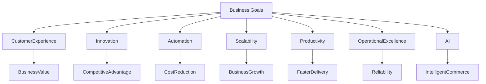

# Business Goals

Strategic Business Objectives of the AI-Commerce Platform

---

## Overview

This document defines the strategic business goals that drive the AI-Commerce Platform.

While the Project Vision establishes the long-term architectural direction, the Business Goals describe the measurable business outcomes that the platform is expected to achieve.

Every architectural decision, engineering initiative, and technology adoption should directly contribute to one or more of these objectives.

---

# Business Vision

The AI-Commerce Platform aims to demonstrate how modern software architecture, Artificial Intelligence, and cloud-native engineering can create intelligent, scalable, and resilient digital commerce ecosystems.

The platform is intentionally designed as both a production-grade reference architecture and an engineering learning platform that showcases enterprise best practices.

---

# Strategic Goals

## 1. Deliver Business Value

Build software that solves real business problems instead of focusing solely on technology.

Expected outcomes include:

- Faster feature delivery
- Improved customer experience
- Higher operational efficiency
- Increased engineering productivity

---

## 2. Accelerate Innovation

Provide an architecture that enables rapid experimentation and continuous delivery of new business capabilities.

Objectives:

- Independent service deployment
- Modular architecture
- AI-assisted development
- Rapid prototyping

---

## 3. Enable Intelligent Automation

Artificial Intelligence should automate repetitive business processes while supporting better decision-making.

Business capabilities include:

- AI Customer Support
- Product Recommendations
- Intelligent Search
- Workflow Automation
- Decision Support
- Operational Insights

---

## 4. Improve Customer Experience

Deliver personalized, reliable, and responsive customer interactions.

Goals include:

- Personalized recommendations
- Faster response times
- Intelligent support
- Seamless authentication
- High availability

---

## 5. Support Business Scalability

The platform must support continuous business growth without requiring architectural redesign.

Business scalability includes:

- Horizontal service scaling
- Independent deployments
- Multi-region readiness
- Cloud-native infrastructure

---

## 6. Reduce Operational Costs

Operational efficiency is achieved through automation and cloud optimization.

Key initiatives include:

- Infrastructure as Code
- CI/CD
- Platform Engineering
- FinOps
- Observability
- Automated Operations

---

## 7. Improve Engineering Productivity

Provide a development platform that enables engineering teams to deliver software faster and with higher quality.

Objectives:

- Developer self-service
- Golden Paths
- Internal Platform
- Automated pipelines
- Standardized architecture

---

## 8. Ensure Operational Excellence

Operations must become predictable, observable, secure, and highly automated.

Expected capabilities:

- Monitoring
- Distributed Tracing
- Centralized Logging
- Alerting
- Incident Response
- Reliability Engineering

---

## 9. Promote AI Adoption

Artificial Intelligence is considered a native platform capability.

The platform encourages AI adoption through:

- AI Agents
- LLM Integration
- Spring AI
- Model Context Protocol (MCP)
- Retrieval-Augmented Generation (RAG)

---

## 10. Establish Engineering Excellence

The platform serves as an enterprise engineering reference implementation.

Engineering excellence is achieved through:

- Domain-Driven Design
- Hexagonal Architecture
- Event-Driven Architecture
- DevSecOps
- Platform Engineering
- Cloud Native
- Infrastructure as Code

---

# Business Success Indicators

The following indicators demonstrate successful business outcomes.

| Objective | Success Indicator |
|-----------|-------------------|
| Customer Experience | High customer satisfaction |
| Engineering Productivity | Reduced lead time |
| Reliability | High availability |
| Innovation | Faster feature delivery |
| Automation | Reduced manual operations |
| Scalability | Horizontal growth |
| AI Adoption | AI integrated into business workflows |
| Cost Optimization | Efficient cloud resource utilization |

---

# Business Goal Alignment

---

# Relationship with Architecture

These business goals directly influence:

- Domain decomposition
- Service boundaries
- Technology selection
- Cloud strategy
- Security architecture
- AI architecture
- Platform engineering
- Operational model

---

# Related Documents

- ADD-001 — Project Vision
- Business Context
- Business Drivers
- Success Metrics
- Architecture Principles

---

> Every architectural decision should support one or more business goals defined in this document.
