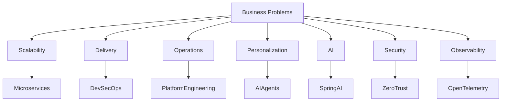

# Business Problem

Understanding the Business Challenges Addressed by the AI-Commerce Platform

---

## Overview

This document defines the core business problems that motivated the creation of the AI-Commerce Platform.

Modern digital commerce environments have become increasingly complex due to rapid business growth, rising customer expectations, distributed operations, and the growing demand for Artificial Intelligence.

Traditional software architectures often struggle to evolve at the same pace as business needs, resulting in increased operational costs, slower software delivery, reduced innovation, and poor customer experiences.

The AI-Commerce Platform addresses these challenges through a modern enterprise architecture built on cloud-native technologies, distributed systems, and AI-driven capabilities.

---

# Business Context

Organizations today operate in highly competitive digital markets where customers expect:

- Personalized experiences
- Real-time interactions
- High availability
- Intelligent recommendations
- Secure transactions
- Continuous innovation

Meeting these expectations requires software platforms that are scalable, resilient, adaptable, and capable of integrating Artificial Intelligence into core business processes.

Many existing commerce platforms are unable to meet these demands due to architectural limitations.

---

# Problem Statement

Traditional commerce systems commonly suffer from tightly coupled architectures, slow release cycles, operational inefficiencies, and limited scalability.

As organizations grow, these limitations become increasingly expensive and difficult to overcome.

The absence of cloud-native engineering, distributed architectures, and intelligent automation often leads to technical debt, reduced engineering productivity, and poor customer satisfaction.

The AI-Commerce Platform was created to address these architectural and operational challenges while providing a modern foundation for future innovation.

---

# Business Challenges

## 1. Limited Scalability

Many commerce platforms are built using monolithic architectures that cannot scale efficiently.

Challenges include:

- Vertical scaling limitations
- Resource contention
- Performance bottlenecks
- Difficult capacity planning

Business Impact

- Reduced system performance
- Poor customer experience
- Increased infrastructure costs

---

## 2. Slow Software Delivery

Large codebases and tightly coupled systems slow down feature development and deployments.

Challenges include:

- Long release cycles
- Complex deployments
- High regression risk
- Manual operational processes

Business Impact

- Delayed business initiatives
- Reduced competitiveness
- Slower innovation

---

## 3. High Operational Complexity

Managing modern distributed applications without proper automation significantly increases operational overhead.

Challenges include:

- Manual deployments
- Infrastructure inconsistencies
- Limited monitoring
- Difficult incident response

Business Impact

- Increased operational costs
- Reduced system reliability
- Longer recovery times

---

## 4. Poor Customer Personalization

Traditional commerce platforms often provide identical experiences to every customer.

Challenges include:

- Static product recommendations
- Generic search results
- Limited behavioral analysis
- Lack of intelligent support

Business Impact

- Lower customer engagement
- Reduced conversion rates
- Lower customer satisfaction

---

## 5. Difficult AI Adoption

Many organizations struggle to integrate Artificial Intelligence into existing architectures.

Challenges include:

- Legacy systems
- Data silos
- Lack of AI infrastructure
- Complex model integration

Business Impact

- Lost innovation opportunities
- Reduced competitiveness
- Limited automation

---

## 6. Distributed Data Challenges

As organizations adopt microservices, maintaining data consistency becomes increasingly complex.

Challenges include:

- Eventual consistency
- Distributed transactions
- Event processing
- Service coordination

Business Impact

- Business inconsistencies
- Operational complexity
- Increased maintenance effort

---

## 7. Limited Observability

Without centralized monitoring, diagnosing production issues becomes extremely difficult.

Challenges include:

- Missing metrics
- Distributed logs
- Lack of tracing
- Poor visibility

Business Impact

- Longer incident resolution
- Reduced availability
- Increased operational risk

---

## 8. Growing Security Requirements

Modern commerce platforms handle sensitive customer and financial information.

Challenges include:

- Authentication
- Authorization
- API protection
- Compliance
- Secret management

Business Impact

- Security incidents
- Compliance risks
- Customer trust issues

---

# Root Causes

The following factors contribute to the problems described above.

| Root Cause | Business Impact |
|------------|-----------------|
| Monolithic architectures | Limited scalability |
| Tight coupling | Slow software evolution |
| Manual processes | High operational costs |
| Legacy technologies | Reduced innovation |
| Limited automation | Low engineering productivity |
| Poor observability | Difficult operations |
| Weak architecture governance | Technical debt |
| Lack of AI strategy | Missed business opportunities |

---

# Desired Business Outcomes

The AI-Commerce Platform aims to eliminate these problems by enabling:

- Intelligent automation
- Cloud-native scalability
- Faster software delivery
- Autonomous business services
- AI-powered customer experiences
- Operational excellence
- Engineering productivity
- Secure-by-design architecture
- Continuous innovation

---

# Solution Strategy

The platform addresses these challenges through modern engineering practices.

| Business Problem | Architectural Solution |
|------------------|------------------------|
| Limited scalability | Microservices Architecture |
| Slow delivery | CI/CD + Platform Engineering |
| Operational complexity | Infrastructure as Code |
| Poor personalization | AI Services |
| Difficult AI adoption | Spring AI + AI Agents |
| Distributed data | Event-Driven Architecture |
| Limited observability | OpenTelemetry |
| Security concerns | OAuth2 + JWT + Zero Trust |

---

# Business Value

Solving these challenges enables organizations to achieve:

- Faster innovation
- Higher customer satisfaction
- Lower operational costs
- Increased engineering productivity
- Improved reliability
- Better business agility
- Scalable cloud infrastructure
- Sustainable long-term growth

---

# Business Problem Map

---

# Relationship with Other Documents

This document supports the following architecture documentation:

- Project Vision
- Business Goals
- Business Drivers
- Architecture Drivers
- Solution Vision
- High-Level Architecture
- Quality Attributes

---

## Key Takeaways

- Modern commerce platforms require cloud-native architectures.
- Artificial Intelligence should be a core business capability.
- Engineering excellence is essential for long-term sustainability.
- Business value drives every architectural decision.
- Distributed systems enable scalability, resilience, and continuous innovation.

---

> Every architectural decision within the AI-Commerce Platform is intended to solve a real business problem while maximizing long-term business value and engineering sustainability.
