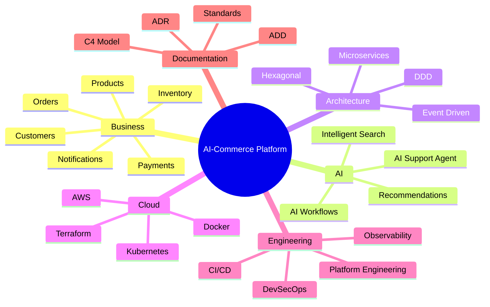

# Project Scope

Scope Definition of the AI-Commerce Platform

---

## Overview

This document defines the scope of the AI-Commerce Platform, establishing the business capabilities, engineering responsibilities, architectural boundaries, and deliverables that are part of the project.

Clearly defining the project scope ensures that architectural decisions remain aligned with business objectives while preventing unnecessary complexity and scope creep.

The AI-Commerce Platform is designed as a production-grade enterprise reference architecture that demonstrates modern software engineering, Artificial Intelligence, cloud-native development, and distributed systems.

---

# Scope Statement

The AI-Commerce Platform is an enterprise cloud-native commerce ecosystem designed to demonstrate how Artificial Intelligence, Domain-Driven Design, Hexagonal Architecture, Event-Driven Architecture, and modern DevOps practices can be combined to build scalable, resilient, and maintainable business systems.

The project serves two complementary purposes:

- A production-grade enterprise reference architecture.
- An educational engineering platform for learning modern software architecture and AI Engineering.

---

# Business Scope

The platform supports the core business capabilities required by a modern digital commerce ecosystem.

These capabilities include:

- Product Management
- Customer Management
- Authentication and Authorization
- Order Processing
- Inventory Management
- Payment Processing
- Notifications
- Customer Support
- Intelligent Product Discovery
- AI-Assisted Customer Experience

---

# Technical Scope

The project covers the implementation of enterprise engineering practices, including:

- Domain-Driven Design (DDD)
- Hexagonal Architecture
- Microservices
- Event-Driven Architecture
- RESTful APIs
- Apache Kafka
- Spring Boot
- Spring AI
- PostgreSQL
- Redis
- Docker
- Kubernetes
- AWS Cloud
- Terraform
- GitHub Actions
- OpenTelemetry
- Prometheus
- Grafana
- Loki
- Tempo

---

# Functional Scope

## Core Services

The platform includes the following business services.

| Service | Responsibility |
|----------|----------------|
| Authentication Service | Identity and access management |
| Product Service | Product catalog management |
| Customer Service | Customer lifecycle management |
| Order Service | Order processing |
| Inventory Service | Inventory management |
| Payment Service | Payment orchestration |
| Notification Service | Email and notification delivery |

---

## AI Services

The platform also includes intelligent business capabilities.

| AI Service | Responsibility |
|------------|----------------|
| AI Support Agent | Customer support automation |
| Recommendation Engine | Personalized recommendations |
| AI Product Assistant | Product discovery |
| Intelligent Search | Semantic product search |
| AI Workflow Engine | Workflow automation |

---

# Platform Scope

The engineering platform includes:

- API Gateway
- Service Discovery
- Configuration Management
- Distributed Cache
- Event Streaming
- Observability Platform
- Centralized Logging
- Distributed Tracing
- Monitoring
- CI/CD Pipelines
- Infrastructure as Code

---

# Cloud Scope

The platform is designed for cloud-native deployment using AWS.

Infrastructure includes:

- Amazon ECS (optional)
- Amazon EKS
- Amazon RDS
- Amazon S3
- Amazon CloudWatch
- AWS IAM
- AWS Secrets Manager
- Amazon API Gateway (future)

Infrastructure provisioning is managed using Terraform.

---

# Engineering Scope

The project demonstrates modern engineering practices.

These include:

- Clean Code
- SOLID Principles
- Domain-Driven Design
- Hexagonal Architecture
- Event-Driven Design
- DevSecOps
- Platform Engineering
- Infrastructure as Code
- Continuous Integration
- Continuous Delivery
- Test Automation
- Documentation First

---

# Documentation Scope

The repository includes comprehensive technical documentation covering:

- Architecture Design Documents (ADD)
- Architecture Decision Records (ADR)
- C4 Model
- Event Storming
- Domain Models
- Sequence Diagrams
- Infrastructure Diagrams
- Deployment Architecture
- API Documentation
- Engineering Standards
- Coding Guidelines

---

# In Scope

The following capabilities are included in the project.

## Business

- Digital Commerce
- Customer Management
- Product Catalog
- Orders
- Authentication
- Inventory
- Payments
- Notifications
- AI Customer Support

---

## Architecture

- Microservices
- Domain-Driven Design
- Hexagonal Architecture
- Event-Driven Architecture
- Cloud Native
- API Gateway
- Distributed Messaging

---

## Artificial Intelligence

- AI Agents
- Spring AI
- LLM Integration
- MCP
- RAG
- AI Automation

---

## DevOps

- Docker
- Kubernetes
- Terraform
- GitHub Actions
- Monitoring
- Logging
- Distributed Tracing

---

# Out of Scope

The following capabilities are intentionally excluded from the current project scope.

## Business

- ERP
- CRM
- Marketplace
- Multi-vendor Commerce
- Native Mobile Applications
- Accounting Systems
- Warehouse Robotics
- Physical POS Systems

---

## Technology

- Blockchain
- Cryptocurrency Payments
- Custom AI Model Training
- Legacy System Migration
- On-Premise Deployment
- Proprietary Cloud Platforms

---

# Assumptions

The project assumes:

- Cloud-native deployment.
- Java as the primary backend language.
- Kubernetes orchestration.
- Event-driven communication.
- AI integration through external LLM providers.
- Infrastructure automation.
- Continuous documentation.

---

# Constraints

The platform operates under the following constraints.

## Technical

- Java 21
- Spring Boot
- PostgreSQL
- Apache Kafka
- AWS
- Docker
- Kubernetes

---

## Business

- Incremental development
- Open-source technologies
- Educational purpose with production standards
- Public documentation

---

# Deliverables

The project produces the following deliverables.

## Software

- Enterprise Microservices
- AI Services
- Frontend Application
- Infrastructure Code

---

## Documentation

- Architecture Documentation
- Engineering Documentation
- API Documentation
- Deployment Guides
- ADR Repository
- Architecture Diagrams

---

## Operations

- CI/CD Pipelines
- Kubernetes Manifests
- Terraform Modules
- Monitoring Dashboards
- Logging Infrastructure

---

# Scope Boundaries

The AI-Commerce Platform focuses on demonstrating enterprise software architecture rather than building a commercial SaaS product.

Every feature included in the project must support at least one of the following objectives:

- Demonstrate an architectural pattern.
- Demonstrate an engineering practice.
- Demonstrate an AI capability.
- Demonstrate a cloud-native capability.
- Demonstrate operational excellence.

Features that do not contribute to these objectives are considered outside the current scope.

---

# Scope Evolution

The project scope will evolve incrementally through future Architecture Decision Records (ADRs).

Potential future additions include:

- Multi-Agent Systems
- Event Sourcing
- CQRS Expansion
- Service Mesh
- Multi-Cloud
- Edge Computing
- GraphQL
- AI Memory
- Autonomous Operations (AIOps)

---

# Scope Overview

---

# Related Documents

- Project Vision
- Business Goals
- Business Problem
- Architecture Drivers
- Design Principles
- Solution Vision
- High-Level Architecture

---

> The project scope defines the functional, technical, and architectural boundaries of the AI-Commerce Platform, ensuring that every implementation decision supports the long-term vision of building a production-grade enterprise reference architecture.
