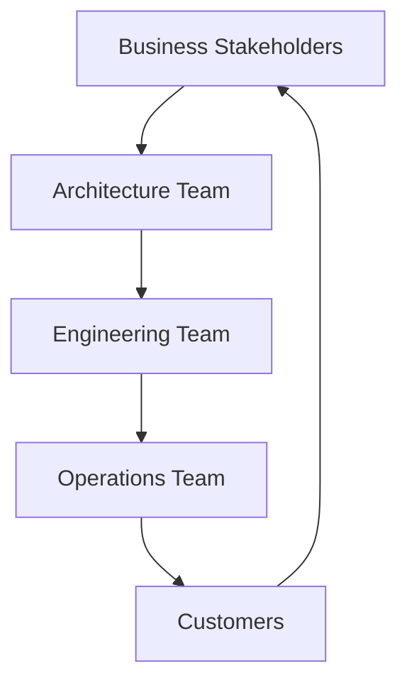

# Stakeholders

Stakeholder Analysis for the AI-Commerce Platform

---

## Overview

This document identifies the stakeholders involved in the AI-Commerce Platform and defines their roles, responsibilities, expectations, and influence throughout the project lifecycle.

Understanding stakeholder needs ensures that business objectives, software architecture, engineering practices, and operational strategies remain aligned as the platform evolves.

The AI-Commerce Platform is designed as an enterprise-grade reference architecture. Therefore, stakeholders span multiple disciplines, including business, software engineering, cloud engineering, artificial intelligence, security, and operations.

---

# Stakeholder Objectives

The stakeholder model supports the following objectives:

- Align business and engineering goals.
- Clarify responsibilities.
- Improve communication.
- Support architecture governance.
- Reduce project risks.
- Facilitate decision-making.
- Promote collaboration across engineering teams.

---

# Stakeholder Categories

The project involves stakeholders from four primary groups:

- Business
- Engineering
- Operations
- End Users

---

# Stakeholder Matrix

| Stakeholder | Role | Primary Objective |
|------------|------|-------------------|
| Executive Sponsor | Strategic Leadership | Business growth |
| Product Owner | Product Management | Business value delivery |
| Software Architect | Architecture Governance | Technical consistency |
| Technical Lead | Engineering Leadership | Delivery excellence |
| Software Engineer | Software Development | High-quality implementation |
| AI Engineer | Artificial Intelligence | Intelligent automation |
| Platform Engineer | Developer Platform | Engineering productivity |
| DevOps Engineer | Infrastructure | Reliable deployments |
| Cloud Engineer | Cloud Platform | Scalable infrastructure |
| Security Engineer | Cybersecurity | Secure platform |
| QA Engineer | Quality Assurance | Product quality |
| Business Analyst | Requirements Analysis | Business alignment |
| UX Designer | User Experience | Customer satisfaction |
| Customers | Platform Consumers | Reliable digital experience |

---

# Stakeholder Responsibilities

## Executive Sponsor

### Responsibilities

- Define strategic direction.
- Approve investments.
- Prioritize business initiatives.
- Measure business outcomes.

### Success Criteria

- Business growth
- Operational efficiency
- Return on investment

---

## Product Owner

### Responsibilities

- Define product vision.
- Manage backlog.
- Prioritize features.
- Validate business value.

### Success Criteria

- Customer satisfaction
- Feature delivery
- Product adoption

---

## Software Architect

### Responsibilities

- Define architecture.
- Maintain architectural consistency.
- Review architecture decisions.
- Approve architectural standards.

### Success Criteria

- Maintainability
- Scalability
- Architectural integrity

---

## Technical Lead

### Responsibilities

- Coordinate engineering activities.
- Support developers.
- Review implementations.
- Ensure engineering quality.

### Success Criteria

- Delivery quality
- Team productivity
- Technical excellence

---

## Software Engineers

### Responsibilities

- Develop business services.
- Implement architecture.
- Maintain code quality.
- Write automated tests.

### Success Criteria

- Clean code
- Reliable software
- Test coverage

---

## AI Engineers

### Responsibilities

- Design AI workflows.
- Integrate LLMs.
- Build AI Agents.
- Improve intelligent automation.

### Success Criteria

- AI accuracy
- Automation
- Business value

---

## Platform Engineers

### Responsibilities

- Build internal developer platform.
- Improve developer experience.
- Automate engineering workflows.
- Standardize tooling.

### Success Criteria

- Developer productivity
- Automation
- Platform reliability

---

## DevOps Engineers

### Responsibilities

- Build CI/CD pipelines.
- Automate deployments.
- Manage infrastructure.
- Improve reliability.

### Success Criteria

- Deployment frequency
- Reliability
- Automation

---

## Cloud Engineers

### Responsibilities

- Design cloud infrastructure.
- Optimize cloud resources.
- Improve scalability.
- Maintain cloud security.

### Success Criteria

- Cost optimization
- Availability
- Cloud scalability

---

## Security Engineers

### Responsibilities

- Secure applications.
- Define security policies.
- Perform security reviews.
- Support compliance.

### Success Criteria

- Zero critical vulnerabilities
- Secure software delivery

---

## QA Engineers

### Responsibilities

- Define testing strategy.
- Execute automated testing.
- Validate software quality.
- Improve reliability.

### Success Criteria

- High software quality
- Low production defects

---

## Business Analysts

### Responsibilities

- Gather requirements.
- Analyze business processes.
- Align business and engineering.

### Success Criteria

- Clear requirements
- Business alignment

---

## UX Designers

### Responsibilities

- Improve usability.
- Design user interfaces.
- Optimize customer experience.

### Success Criteria

- User satisfaction
- Accessibility
- Simplicity

---

## Customers

### Expectations

Customers expect:

- Reliable services
- Fast responses
- Secure authentication
- Personalized experiences
- High availability
- Intelligent support

---

# Stakeholder Influence Matrix

| Stakeholder | Influence | Interest |
|------------|-----------|----------|
| Executive Sponsor | High | High |
| Product Owner | High | High |
| Software Architect | High | High |
| Technical Lead | High | High |
| Software Engineer | Medium | High |
| AI Engineer | Medium | High |
| Platform Engineer | Medium | High |
| DevOps Engineer | Medium | High |
| Cloud Engineer | Medium | Medium |
| Security Engineer | High | High |
| QA Engineer | Medium | High |
| Business Analyst | Medium | High |
| UX Designer | Medium | Medium |
| Customers | High | High |

---

# Communication Strategy

| Stakeholder | Communication |
|-------------|---------------|
| Executive Sponsor | Architecture Reviews |
| Product Owner | Sprint Reviews |
| Architects | Architecture Governance Meetings |
| Engineering Teams | Daily Collaboration |
| DevOps | Release Planning |
| Security | Security Reviews |
| Business | Product Demonstrations |
| Customers | Product Releases |

---

# Stakeholder Expectations

## Business

Business stakeholders expect:

- Faster delivery
- Operational efficiency
- Innovation
- Lower costs
- Business scalability

---

## Engineering

Engineering teams expect:

- Clear architecture
- Development standards
- Automation
- Documentation
- Developer productivity

---

## Operations

Operations teams expect:

- Reliable deployments
- Observability
- Infrastructure automation
- Monitoring
- Incident reduction

---

## Customers

Customers expect:

- Excellent user experience
- Reliable services
- Security
- Fast performance
- Intelligent interactions

---

# RACI Matrix

| Activity | Executive | Product Owner | Architect | Tech Lead | Engineers | DevOps | QA |
|-----------|-----------|---------------|------------|-----------|-----------|---------|-----|
| Business Strategy | A | C | I | I | I | I | I |
| Architecture Design | I | C | A | R | C | C | I |
| Software Development | I | I | C | A | R | I | C |
| AI Development | I | I | C | C | R | I | I |
| Infrastructure | I | I | C | C | I | A/R | I |
| Testing | I | I | I | C | R | I | A |
| Deployment | I | I | C | C | I | A/R | C |

**Legend**

- **R** — Responsible
- **A** — Accountable
- **C** — Consulted
- **I** — Informed

---

# Stakeholder Collaboration

---

# Governance Principles

The AI-Commerce Platform follows these governance principles:

- Business-driven architecture
- Documentation-first approach
- Shared ownership
- Continuous feedback
- Architecture governance
- Engineering excellence
- Security by Design
- Operational excellence

---

# Related Documents

- Project Vision
- Business Goals
- Project Scope
- Architecture Drivers
- Design Principles
- Architecture Governance
- Team Topology

---

> Every stakeholder contributes to the success of the AI-Commerce Platform by ensuring that business objectives, architectural decisions, engineering practices, and operational excellence remain continuously aligned throughout the software lifecycle.
