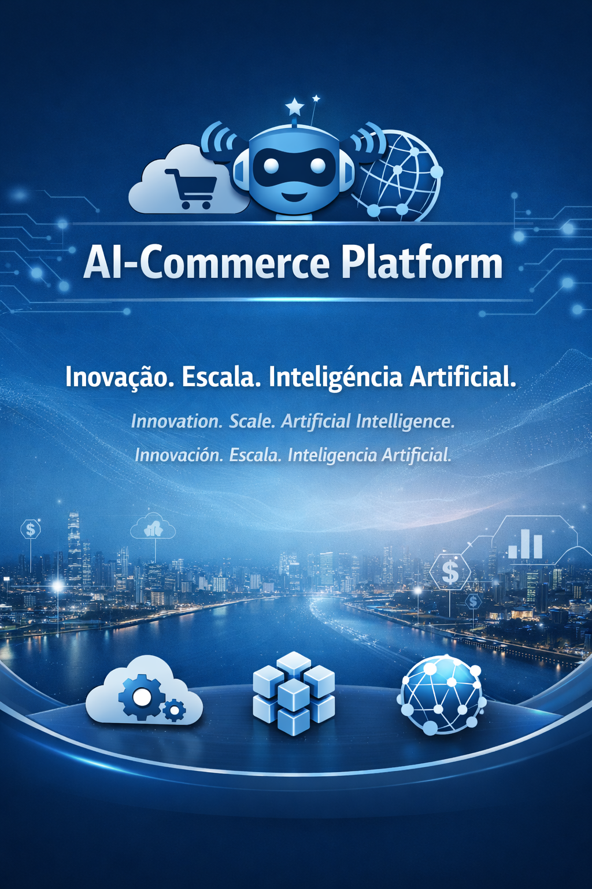
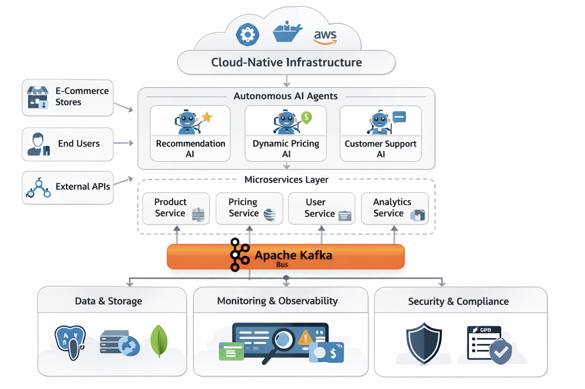

# AI-Commerce Platform – Visão do Projeto

---
# Template Corporativo / Plantilla Corporativa / Corporate Template

---

## 1. Sumário Executivo / Resumen Ejecutivo / Executive Summary
Breve descrição do propósito do documento e seu papel dentro do projeto.

---

## 2. Contexto / Contexto / Context
Explique o cenário, motivação e relevância do tema abordado.

---

## 3. Objetivos / Objetivos / Objectives
Liste os objetivos principais e secundários do documento ou módulo.

---

## 4. Estrutura / Estructura / Structure
Descreva como o conteúdo está organizado (capítulos, seções, anexos).

---

## 5. Responsáveis / Responsables / Responsible Parties
| Função / Role | Nome / Name | Contato / Contact |
|----------------|--------------|-------------------|
| Product Owner | — | — |
| Tech Lead | — | — |
| Arquitetura | — | — |

---

## 6. Referências / Referencias / References
Liste documentos, links ou normas que fundamentam o conteúdo.

---

## 7. Histórico de Revisões / Revision History / Historial de Revisiones
| Versão / Version | Data / Date | Autor / Author | Descrição / Description |
|------------------|--------------|----------------|--------------------------|
| 1.0 | — | — | Criação inicial |
| 1.1 | — | — | Atualização de conteúdo |

---

## 8. Observações / Observaciones / Notes
Espaço para comentários adicionais, decisões pendentes ou observações técnicas.

## 1. Introdução
📚 **Conceito**: Apresentar o propósito da plataforma e sua importância estratégica.  
🏢 **Prática de Mercado**: Empresas como Amazon e Microsoft começam esclarecendo o “porquê” antes do “como”.  
🎯 **Aplicação**: Explicar por que a AI-Commerce existe e qual problema de negócio ela resolve.

## 2. Visão
📚 **Conceito**: Uma declaração clara do estado futuro que a plataforma busca alcançar.  
🏢 **Prática de Mercado**: Documentos de visão descrevem o impacto de longo prazo.  
🎯 **Aplicação**: Definir como agentes de IA e microsserviços vão transformar o comércio eletrônico.

## 3. Missão
📚 **Conceito**: O caminho prático para alcançar a visão.  
🏢 **Prática de Mercado**: Missões orientam a execução diária.  
🎯 **Aplicação**: Detalhar como a plataforma entregará experiências de comércio inteligente.

## 4. Problema de Negócio
📚 **Conceito**: Identificar os pontos de dor nas soluções atuais de e-commerce.  
🏢 **Prática de Mercado**: Documentos de arquitetura sempre começam pelo desafio de negócio.  
🎯 **Aplicação**: Descrever ineficiências, falta de personalização e problemas de escalabilidade.

## 5. Público-Alvo
📚 **Conceito**: Definir quem se beneficia da plataforma.  
🏢 **Prática de Mercado**: Stakeholders incluem clientes, desenvolvedores e equipes de negócios.  
🎯 **Aplicação**: Identificar lojistas, consumidores e engenheiros de IA.

## 6. Escopo da Plataforma
📚 **Conceito**: Limites do sistema.  
🏢 **Prática de Mercado**: Escopo evita expansão descontrolada.  
🎯 **Aplicação**: Esclarecer o que a plataforma fará e o que não fará.

## 7. Objetivos Funcionais
📚 **Conceito**: Capacidades que o sistema deve entregar.  
🏢 **Prática de Mercado**: Objetivos são mensuráveis e testáveis.  
🎯 **Aplicação**: Recomendações inteligentes de produtos, precificação dinâmica, suporte automatizado ao cliente.

## 8. Objetivos Não Funcionais
📚 **Conceito**: Atributos de qualidade do sistema.  
🏢 **Prática de Mercado**: Disponibilidade, escalabilidade, performance, segurança, observabilidade, manutenibilidade.  
🎯 **Aplicação**: Definir SLAs, conformidade e metas de resiliência.

## 9. Arquitetura de Alto Nível
📚 **Conceito**: Visão geral do design do sistema.  
🏢 **Prática de Mercado**: Diagramas de arquitetura mostram componentes e interações.  
🎯 **Aplicação**: Descrever agentes de IA, microsserviços, comunicação orientada a eventos e infraestrutura em nuvem.

## 10. Stack Tecnológico
📚 **Conceito**: Ferramentas e frameworks escolhidos.  
🏢 **Prática de Mercado**: Decisões de stack são justificadas por escalabilidade e suporte.  
🎯 **Aplicação**: Linguagens, frameworks, bancos de dados, provedores de nuvem.

## 11. Resultados Esperados
📚 **Conceito**: O que significa sucesso.  
🏢 **Prática de Mercado**: Resultados são vinculados a ROI e KPIs.  
🎯 **Aplicação**: Aumento de conversão, redução de custos operacionais, melhoria na satisfação do cliente.

## 12. Roadmap
📚 **Conceito**: Linha do tempo da evolução.  
🏢 **Prática de Mercado**: Roadmaps alinham marcos técnicos com objetivos de negócio.  
🎯 **Aplicação**: Fases de entrega, do MVP ao rollout global.

---

## 1. Introdução 

### Português
A AI-Commerce Platform foi criada para redefinir o comércio eletrônico através da integração de **agentes inteligentes**, **microsserviços** e **arquiteturas orientadas a eventos**.  
Seu propósito é resolver ineficiências atuais, ampliar a personalização e permitir operações globais escaláveis.  
Mais do que uma solução tecnológica, é uma visão estratégica para transformar a forma como empresas e consumidores interagem digitalmente.

### Español
La Plataforma AI-Commerce fue diseñada para redefinir el comercio electrónico mediante la integración de **agentes inteligentes**, **microservicios** y **arquitecturas orientadas a eventos**.  
Su propósito es resolver las ineficiencias actuales, mejorar la personalización y permitir operaciones globales escalables.  
Más que una solución tecnológica, es una visión estratégica para transformar la manera en que empresas y consumidores interactúan digitalmente.

### English
The AI-Commerce Platform was created to redefine e-commerce by integrating **intelligent agents**, **microservices**, and **event-driven architectures**.  
Its purpose is to solve current inefficiencies, enhance personalization, and enable scalable global operations.  
More than a technological solution, it represents a strategic vision to transform how companies and consumers interact digitally.
---

## 2. Visão / Visión / Vision

A visão da AI-Commerce Platform é criar um **ecossistema global de comércio inteligente**, onde agentes de IA impulsionam eficiência, personalização e inovação em escala.  
A plataforma será reconhecida como referência mundial em arquitetura de microsserviços, agentes autônomos e operações orientadas a dados, transformando a forma como empresas e consumidores interagem digitalmente.

### Español
La visión de la Plataforma AI-Commerce es construir un **ecosistema global de comercio inteligente**, donde los agentes de IA impulsen la eficiencia, la personalización y la innovación a gran escala.  
La plataforma será reconocida como referencia mundial en arquitectura de microservicios, agentes autónomos y operaciones orientadas a datos, transformando la manera en que empresas y consumidores interactúan digitalmente.

### English
The vision of the AI-Commerce Platform is to establish a **global intelligent commerce ecosystem**, where AI agents drive efficiency, personalization, and innovation at scale.  
The platform will be recognized worldwide as a benchmark in microservices architecture, autonomous agents, and data-driven operations, transforming how companies and consumers interact digitally.

## 3. Missão / Misión / Mission

### Português
A missão da AI-Commerce Platform é **entregar experiências de comércio inteligente**, combinando engenharia de IA, microsserviços e arquiteturas nativas em nuvem.  
Nosso objetivo é permitir que empresas criem soluções escaláveis, seguras e personalizadas, transformando dados em decisões estratégicas e aumentando a eficiência operacional.

### Español
La misión de la Plataforma AI-Commerce es **ofrecer experiencias de comercio inteligente**, combinando ingeniería de IA, microservicios y arquitecturas nativas en la nube.  
Nuestro objetivo es permitir que las empresas desarrollen soluciones escalables, seguras y personalizadas, transformando datos en decisiones estratégicas y aumentando la eficiencia operativa.

### English
The mission of the AI-Commerce Platform is to **deliver intelligent commerce experiences**, combining AI engineering, microservices, and cloud-native architectures.  
Our goal is to enable companies to build scalable, secure, and personalized solutions, turning data into strategic decisions and enhancing operational efficiency.

## 4. Problema de Negócio / Business Problem / Problema de Negocio

### Português
O comércio eletrônico atual enfrenta desafios críticos:
- **Ineficiências operacionais**: processos manuais e pouco escaláveis.
- **Falta de personalização**: experiências genéricas que reduzem conversão e engajamento.
- **Escalabilidade limitada**: dificuldade em expandir globalmente mantendo qualidade e performance.  
  A AI-Commerce Platform surge para superar essas barreiras, oferecendo soluções inteligentes e adaptáveis que alinham tecnologia e estratégia de negócios.

### Español
El comercio electrónico actual enfrenta desafíos críticos:
- **Ineficiencias operativas**: procesos manuales y poco escalables.
- **Falta de personalización**: experiencias genéricas que reducen la conversión y el compromiso.
- **Escalabilidad limitada**: dificultad para expandirse globalmente manteniendo calidad y rendimiento.  
  La Plataforma AI-Commerce nace para superar estas barreras, ofreciendo soluciones inteligentes y adaptables que alinean tecnología y estrategia de negocio.

### English
Current e-commerce faces critical challenges:
- **Operational inefficiencies**: manual processes with limited scalability.
- **Lack of personalization**: generic experiences that reduce conversion and engagement.
- **Limited scalability**: difficulty expanding globally while maintaining quality and performance.  
  The AI-Commerce Platform was created to overcome these barriers, delivering intelligent and adaptive solutions that align technology with business strategy.

## 5. Público-Alvo / Target Audience / Público Objetivo

### Português
O público-alvo da AI-Commerce Platform inclui:
- **Lojistas e empresas de e-commerce**: que buscam escalabilidade, personalização e eficiência operacional.
- **Consumidores finais**: que desejam experiências digitais mais inteligentes, rápidas e personalizadas.
- **Engenheiros e arquitetos de IA**: que precisam de uma infraestrutura robusta para desenvolver e operar agentes autônomos.
- **Investidores e stakeholders corporativos**: interessados em inovação, ROI e diferenciação competitiva.

### Español
El público objetivo de la Plataforma AI-Commerce incluye:
- **Comerciantes y empresas de e-commerce**: que buscan escalabilidad, personalización y eficiencia operativa.
- **Consumidores finales**: que desean experiencias digitales más inteligentes, rápidas y personalizadas.
- **Ingenieros y arquitectos de IA**: que necesitan una infraestructura sólida para desarrollar y operar agentes autónomos.
- **Inversores y stakeholders corporativos**: interesados en innovación, ROI y diferenciación competitiva.

### English
The target audience of the AI-Commerce Platform includes:
- **Merchants and e-commerce companies**: seeking scalability, personalization, and operational efficiency.
- **End consumers**: looking for smarter, faster, and more personalized digital experiences.
- **AI engineers and architects**: requiring a robust infrastructure to develop and operate autonomous agents.
- **Investors and corporate stakeholders**: focused on innovation, ROI, and competitive differentiation.  

## 6. Escopo da Plataforma / Platform Scope / Alcance de la Plataforma

### Português
O escopo da AI-Commerce Platform estabelece os limites claros de atuação:
- **Inclui**: agentes de IA autônomos, microsserviços escaláveis, integração com APIs externas, suporte a operações globais e observabilidade avançada.
- **Não inclui**: desenvolvimento de hardware proprietário, serviços financeiros diretos ou funcionalidades fora do domínio de comércio eletrônico.  
  Esse escopo garante foco estratégico, evitando expansão descontrolada e mantendo a plataforma alinhada às necessidades reais do mercado.

### Español
El alcance de la Plataforma AI-Commerce establece límites claros de actuación:
- **Incluye**: agentes de IA autónomos, microservicios escalables, integración con APIs externas, soporte para operaciones globales y observabilidad avanzada.
- **No incluye**: desarrollo de hardware propietario, servicios financieros directos o funcionalidades fuera del dominio del comercio electrónico.  
  Este alcance asegura un enfoque estratégico, evitando la expansión descontrolada y manteniendo la plataforma alineada con las necesidades reales del mercado.

### English
The scope of the AI-Commerce Platform defines clear boundaries:
- **Includes**: autonomous AI agents, scalable microservices, external API integrations, global operations support, and advanced observability.
- **Excludes**: proprietary hardware development, direct financial services, or features outside the e-commerce domain.  
  This scope ensures strategic focus, prevents uncontrolled expansion, and keeps the platform aligned with real market needs.

## 7. Objetivos Funcionais / Functional Goals / Objetivos Funcionales

### Português
Os objetivos funcionais da AI-Commerce Platform incluem:
- **Recomendações inteligentes de produtos**: agentes de IA que analisam comportamento e preferências para sugerir ofertas personalizadas.
- **Precificação dinâmica**: ajuste automático de preços com base em demanda, concorrência e contexto de mercado.
- **Suporte automatizado ao cliente**: agentes conversacionais capazes de resolver dúvidas e problemas em tempo real.
- **Integração com APIs externas**: conectividade com sistemas de pagamento, logística e marketplaces globais.
- **Gestão orientada a dados**: dashboards e relatórios inteligentes para apoiar decisões estratégicas.

### Español
Los objetivos funcionales de la Plataforma AI-Commerce incluyen:
- **Recomendaciones inteligentes de productos**: agentes de IA que analizan comportamiento y preferencias para sugerir ofertas personalizadas.
- **Precios dinámicos**: ajuste automático de precios basado en demanda, competencia y contexto de mercado.
- **Soporte automatizado al cliente**: agentes conversacionales capaces de resolver dudas y problemas en tiempo real.
- **Integración con APIs externas**: conectividad con sistemas de pago, logística y marketplaces globales.
- **Gestión orientada a datos**: paneles e informes inteligentes para apoyar decisiones estratégicas.

### English
The functional goals of the AI-Commerce Platform include:
- **Intelligent product recommendations**: AI agents analyzing behavior and preferences to suggest personalized offers.
- **Dynamic pricing**: automatic price adjustments based on demand, competition, and market context.
- **Automated customer support**: conversational agents capable of solving issues in real time.
- **External API integrations**: connectivity with payment systems, logistics, and global marketplaces.
- **Data-driven management**: intelligent dashboards and reports to support strategic decision-making.  

## 8. Objetivos Não Funcionais / Non-Functional Goals / Objetivos No Funcionales

### Português
Os objetivos não funcionais da AI-Commerce Platform incluem:
- **Disponibilidade**: garantir alta disponibilidade (SLA ≥ 99,9%) para operações globais.
- **Escalabilidade**: suportar crescimento exponencial de usuários e transações sem perda de performance.
- **Performance**: tempos de resposta baixos, mesmo em cenários de alta carga.
- **Segurança**: conformidade com padrões internacionais (ISO, GDPR, LGPD) e proteção contra ataques.
- **Observabilidade**: monitoramento em tempo real, métricas, logs e alertas inteligentes.
- **Manutenibilidade**: arquitetura modular que facilita evolução e correção de falhas.

### Español
Los objetivos no funcionales de la Plataforma AI-Commerce incluyen:
- **Disponibilidad**: garantizar alta disponibilidad (SLA ≥ 99,9%) para operaciones globales.
- **Escalabilidad**: soportar crecimiento exponencial de usuarios y transacciones sin pérdida de rendimiento.
- **Rendimiento**: tiempos de respuesta bajos incluso en escenarios de alta carga.
- **Seguridad**: cumplimiento de estándares internacionales (ISO, GDPR, LGPD) y protección contra ataques.
- **Observabilidad**: monitoreo en tiempo real, métricas, registros y alertas inteligentes.
- **Mantenibilidad**: arquitectura modular que facilita la evolución y la corrección de fallos.

### English
The non-functional goals of the AI-Commerce Platform include:
- **Availability**: ensure high availability (SLA ≥ 99.9%) for global operations.
- **Scalability**: support exponential growth of users and transactions without performance loss.
- **Performance**: maintain low response times even under heavy load.
- **Security**: comply with international standards (ISO, GDPR, LGPD) and protect against threats.
- **Observability**: real-time monitoring, metrics, logs, and intelligent alerts.
- **Maintainability**: modular architecture enabling easy evolution and fault correction.  

## 9. Arquitetura de Alto Nível / High-Level Architecture / Arquitectura de Alto Nivel

### Português
A arquitetura de alto nível da AI-Commerce Platform é baseada em três pilares:
- **Agentes de IA Autônomos**: responsáveis por recomendações, precificação dinâmica e suporte ao cliente.
- **Microsserviços Escaláveis**: cada funcionalidade é isolada em serviços independentes, garantindo modularidade e evolução contínua.
- **Comunicação Orientada a Eventos**: integração assíncrona entre serviços, permitindo alta performance e resiliência.  
  A infraestrutura será **cloud-native**, utilizando contêineres, Kubernetes e observabilidade avançada para suportar operações globais.
#  Arquitetura de Alto Nível da AI-Commerce

### Español
La arquitectura de alto nivel de la Plataforma AI-Commerce se basa en tres pilares:
- **Agentes de IA Autónomos**: responsables de recomendaciones, precios dinámicos y soporte al cliente.
- **Microservicios Escalables**: cada funcionalidad está aislada en servicios independientes, garantizando modularidad y evolución continua.
- **Comunicación Orientada a Eventos**: integración asíncrona entre servicios, permitiendo alto rendimiento y resiliencia.  
  La infraestructura será **cloud-native**, utilizando contenedores, Kubernetes y observabilidad avanzada para soportar operaciones globales.

### English
The high-level architecture of the AI-Commerce Platform is built on three pillars:
- **Autonomous AI Agents**: responsible for recommendations, dynamic pricing, and customer support.
- **Scalable Microservices**: each functionality is isolated into independent services, ensuring modularity and continuous evolution.
- **Event-Driven Communication**: asynchronous integration between services, enabling high performance and resilience.  
  The infrastructure will be **cloud-native**, leveraging containers, Kubernetes, and advanced observability to support global operations.

## 10. Stack Tecnológico / Technology Stack / Stack Tecnológico

### Português
A AI-Commerce Platform será construída sobre um stack tecnológico moderno e robusto:
- **Linguagens de Programação**: Java, Python e TypeScript para diferentes camadas da solução.
- **Frameworks**: Spring Boot para microsserviços, FastAPI para agentes de IA e Next.js para front-end.
- **Banco de Dados**: PostgreSQL para dados relacionais e MongoDB para dados não estruturados.
- **Mensageria/Eventos**: Apache Kafka para comunicação orientada a eventos.
- **Infraestrutura**: Kubernetes para orquestração de contêineres, Docker para empacotamento e Terraform para infraestrutura como código.
- **Cloud Provider**: AWS como base principal, com suporte a serviços de IA e escalabilidade global.

### Español
La Plataforma AI-Commerce se construirá sobre un stack tecnológico moderno y robusto:
- **Lenguajes de Programación**: Java, Python y TypeScript para diferentes capas de la solución.
- **Frameworks**: Spring Boot para microservicios, FastAPI para agentes de IA y Next.js para front-end.
- **Base de Datos**: PostgreSQL para datos relacionales y MongoDB para datos no estructurados.
- **Mensajería/Eventos**: Apache Kafka para comunicación orientada a eventos.
- **Infraestructura**: Kubernetes para orquestación de contenedores, Docker para empaquetado y Terraform para infraestructura como código.
- **Proveedor Cloud**: AWS como base principal, con soporte para servicios de IA y escalabilidad global.

### English
The AI-Commerce Platform will be built on a modern and robust technology stack:
- **Programming Languages**: Java, Python, and TypeScript for different layers of the solution.
- **Frameworks**: Spring Boot for microservices, FastAPI for AI agents, and Next.js for front-end.
- **Databases**: PostgreSQL for relational data and MongoDB for unstructured data.
- **Messaging/Events**: Apache Kafka for event-driven communication.
- **Infrastructure**: Kubernetes for container orchestration, Docker for packaging, and Terraform for infrastructure as code.
- **Cloud Provider**: AWS as the primary base, supporting AI services and global scalability.  

## 11. Resultados Esperados / Expected Outcomes / Resultados Esperados

### Português
Os resultados esperados da AI-Commerce Platform incluem:
- **Aumento da taxa de conversão**: experiências personalizadas que elevam vendas e engajamento.
- **Redução de custos operacionais**: automação inteligente que elimina processos manuais e ineficientes.
- **Melhoria na satisfação do cliente**: suporte em tempo real e recomendações precisas.
- **Escalabilidade global**: capacidade de atender milhões de usuários simultaneamente em diferentes regiões.
- **ROI sustentável**: retorno sobre investimento alinhado a métricas de negócio e inovação contínua.

### Español
Los resultados esperados de la Plataforma AI-Commerce incluyen:
- **Incremento en la tasa de conversión**: experiencias personalizadas que aumentan ventas y compromiso.
- **Reducción de costos operativos**: automatización inteligente que elimina procesos manuales e ineficientes.
- **Mejora en la satisfacción del cliente**: soporte en tiempo real y recomendaciones precisas.
- **Escalabilidad global**: capacidad de atender a millones de usuarios simultáneamente en diferentes regiones.
- **ROI sostenible**: retorno sobre la inversión alineado con métricas de negocio e innovación continua.

### English
The expected outcomes of the AI-Commerce Platform include:
- **Increased conversion rates**: personalized experiences driving higher sales and engagement.
- **Reduced operational costs**: intelligent automation eliminating manual and inefficient processes.
- **Improved customer satisfaction**: real-time support and accurate recommendations.
- **Global scalability**: ability to serve millions of users simultaneously across regions.
- **Sustainable ROI**: return on investment aligned with business metrics and continuous innovation.  

## 12. Roadmap / Roadmap / Hoja de Ruta

### Português
O roadmap da AI-Commerce Platform será dividido em fases estratégicas:
- **Fase 1 – MVP**: entrega inicial com agentes de IA básicos, microsserviços principais e integração com APIs essenciais.
- **Fase 2 – Expansão Regional**: suporte a múltiplos idiomas, integração com sistemas de pagamento locais e otimização de performance.
- **Fase 3 – Escalabilidade Global**: infraestrutura cloud-native totalmente distribuída, observabilidade avançada e suporte a milhões de usuários simultâneos.
- **Fase 4 – Inovação Contínua**: inclusão de novos agentes autônomos, precificação preditiva e integração com marketplaces emergentes.

### Español
El roadmap de la Plataforma AI-Commerce se dividirá en fases estratégicas:
- **Fase 1 – MVP**: entrega inicial con agentes de IA básicos, microservicios principales e integración con APIs esenciales.
- **Fase 2 – Expansión Regional**: soporte para múltiples idiomas, integración con sistemas de pago locales y optimización de rendimiento.
- **Fase 3 – Escalabilidad Global**: infraestructura cloud-native totalmente distribuida, observabilidad avanzada y soporte para millones de usuarios simultáneos.
- **Fase 4 – Innovación Continua**: incorporación de nuevos agentes autónomos, precios predictivos e integración con marketplaces emergentes.

### English
The roadmap of the AI-Commerce Platform will be divided into strategic phases:
- **Phase 1 – MVP**: initial delivery with basic AI agents, core microservices, and essential API integrations.
- **Phase 2 – Regional Expansion**: support for multiple languages, integration with local payment systems, and performance optimization.
- **Phase 3 – Global Scalability**: fully distributed cloud-native infrastructure, advanced observability, and support for millions of simultaneous users.
- **Phase 4 – Continuous Innovation**: addition of new autonomous agents, predictive pricing, and integration with emerging marketplaces.  

# Sumário Executivo / Resumen Ejecutivo / Executive Summary

### Português
A **AI-Commerce Platform** é uma iniciativa estratégica para transformar o comércio eletrônico global.  
Integrando **agentes de IA autônomos**, **microsserviços escaláveis** e **arquiteturas orientadas a eventos**, a plataforma busca resolver ineficiências, ampliar a personalização e garantir operações seguras e resilientes em escala mundial.  
Com foco em inovação contínua, a solução conecta tecnologia e negócios, oferecendo experiências digitais inteligentes para lojistas, consumidores e stakeholders corporativos.

### Español
La **Plataforma AI-Commerce** es una iniciativa estratégica para transformar el comercio electrónico global.  
Al integrar **agentes de IA autónomos**, **microservicios escalables** y **arquitecturas orientadas a eventos**, la plataforma busca resolver ineficiencias, mejorar la personalización y garantizar operaciones seguras y resilientes a escala mundial.  
Con un enfoque en innovación continua, la solución conecta tecnología y negocio, ofreciendo experiencias digitales inteligentes para comerciantes, consumidores y stakeholders corporativos.

### English
The **AI-Commerce Platform** is a strategic initiative to transform global e-commerce.  
By integrating **autonomous AI agents**, **scalable microservices**, and **event-driven architectures**, the platform aims to solve inefficiencies, enhance personalization, and ensure secure and resilient operations worldwide.  
With a focus on continuous innovation, the solution bridges technology and business, delivering intelligent digital experiences for merchants, consumers, and corporate stakeholders.
